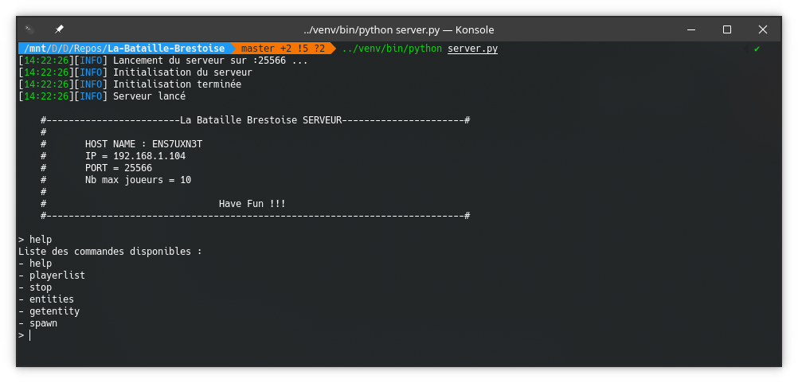
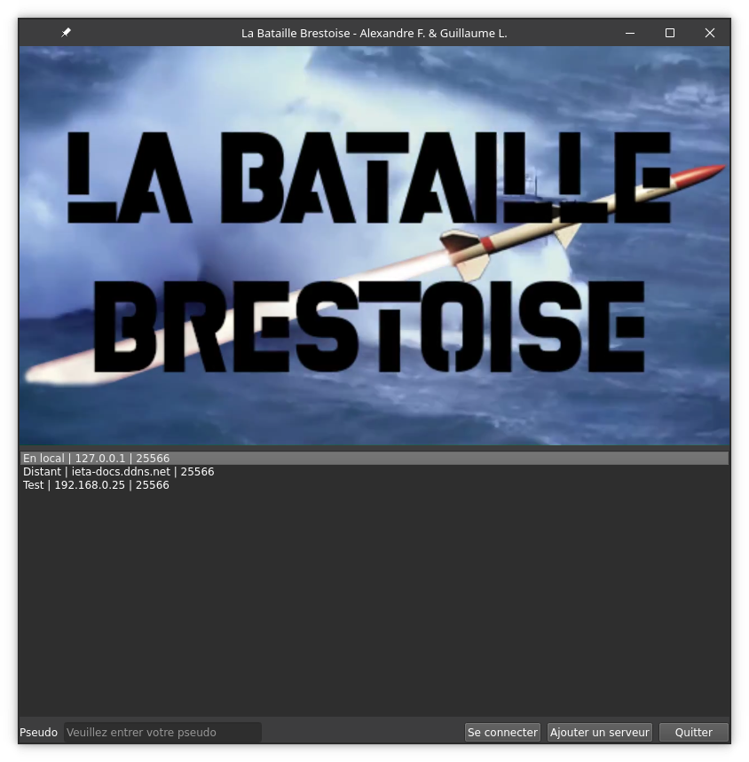
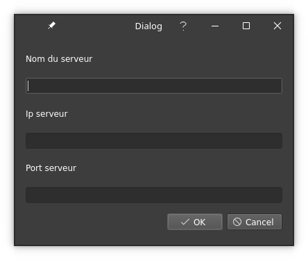
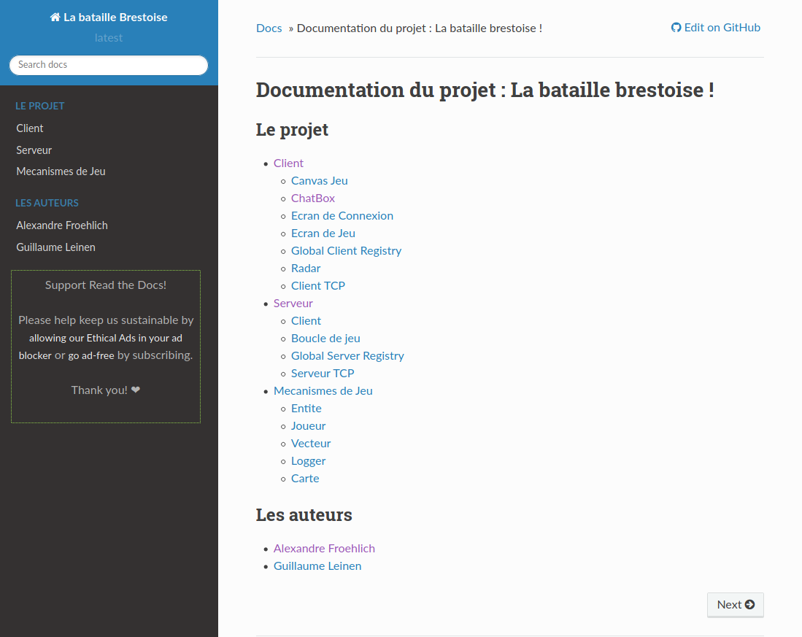

# La Bataille Brestoise
Projet d'informatique pour l'U.E. 2.4. à l'ENSTA Bretagne.  

Pour ce projet d’informatique, nous avons décidé de prendre un sujet autre que
ceux proposés par nos enseignants. Ayant fait tous les deux une année zéro dans la
marine nationale, un sujet proche de ce que l’on avait vécut semblait la solution
évidente.  
Nous sommes donc parti sur un jeu de type bataille navale, en temps réel et
multijoueurs que nous avons nommé :  


Il s'agit d'un jeu de bataille navale multijoueurs en temps réel basé dans la rade de Brest. Le joueur peut jouer contre d'autres entitées contrôlées par le serveur ou bien contre des joueurs réeels.

## Installation
Le projet nécessite des bibliothèques python particulières. Heureusement pour vous, vous pouvez les installer avec *pip* :  
```bash
pip install -r requirements.txt
```

Le projet nécessite au minimum python 3.6.1.

## Lancer le serveur
Pour configurer les paramètres du serveur, veuillez modifier le fichier `server_config.json`.  
Vous pourrez alors modifier l'adresse IP sur laquelle le serveur se lance (127.0.0.1 est recommandé) ainsi que le port d'écoute.  

Une fois paramétré il vous suffit de lancer le script serveur :   
```bash
python server.py
```  
Vous pourrez alors lancer le client ou bien essayer les commandes serveur en tapant `help` dans la console.



Les commandes serveur :
* `help` : permet d'afficher la liste des commandes
* `playerlist` : affiche le nombre de joueurs ainsi que la liste des joueurs connectés
* `stop` : arrête **proprement** le serveur
* `entities` : affiche la liste des entités présentes sur le serveur
* `getentity <#entité>` : affiche les informations sur l'entité numéro #entité
* `spawn <type> <x> <y>` : fait apparaitre une entité du type "type" à la position x y.

## Lancer le client
Une fois le serveur lancé vous pouvez lancer le client en exécutant le script client :  
```bash
python client.py
```

Sur l'écran d'accueil vous pourrez choisir le serveur sur lequel vous connecter (s'il est ouvert).


Vous pouvez toujours ajouter un serveur personnalisé à la liste en cliquant sur le bouton "ajouter un serveur".  
Ces serveurs seront enregistrés dans le fichier `known_servers.json`.  


### Comment jouer

* Flèches du clavier : changer la direction du joueur
* Clique souris sur entité : cible l'entité (pour l'attaquer)
* Barre espace : démarre/arrête l'attaque sur la cible

Pour écrire des messages aux autres joueurs, il faut cliquer dans la barre correspondante puis pour l'envoyer en appuyant sur envoyer.
Attention, pour intéragir avec son bâtiment il faut cliquer sur la carte. 
Les commandes joueur :
* `/help` : afficher l'aide des commandes
* `/start` : démarrer la partie
* `/exp` : afficher l'expérience du joueur
* `/vie` : afficher la vie du joueur

## Accéder à la documentation
La documentation du projet peut se trouver à deux endroits :

### En local
Pour accéder à la documentation en local dans le dossier du projet, aller dans le dossier `/doc/build/` puis ouvrir le fichier `index.html`.

### En ligne sur readthedocs.org
En utilisant Sphinx, et en utilisant les connexions entre Github et ReadTheDocs, on peut compiler la documentation et l'afficher directement en ligne.  
Ainsi la documentation de ce projet est disponible à l'adresse suivante :  
[https://la-bataille-brestoise.readthedocs.io/fr/latest/](https://la-bataille-brestoise.readthedocs.io/fr/latest/).



Pour plus d'information, aller sur le git du projet : [https://github.com/NightlySide/La-Bataille-Brestoise](https://github.com/NightlySide/La-Bataille-Brestoise)